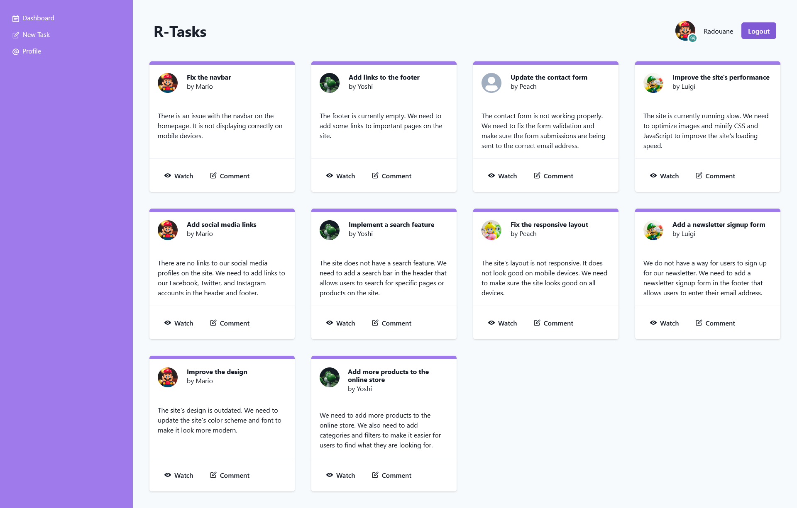
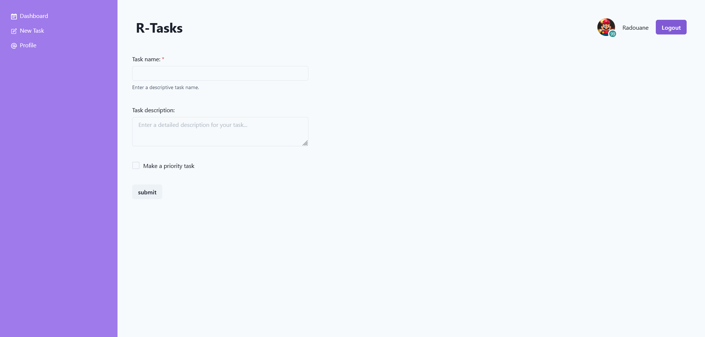
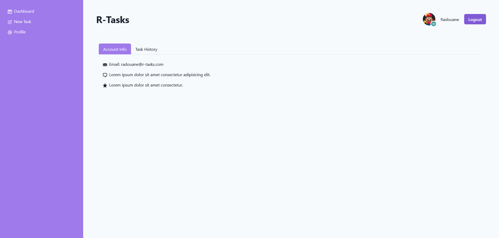

# R Tasks
Front-end application for managing tasks. The application is written in ReactJS and uses the Chakra UI library for styling.

## Installation
1. Clone the repository
2. Install dependencies
```bash
npm install
```
3. Run the json-server for the fake Task API
```bash
json-server --watch ./data/db.json 
```
4. Run the application
```bash
npm run dev
```
this will start the development server on [http://localhost:5173](http://localhost:5173).

## Usage

### Dashboard


### Add Task


### Profile



